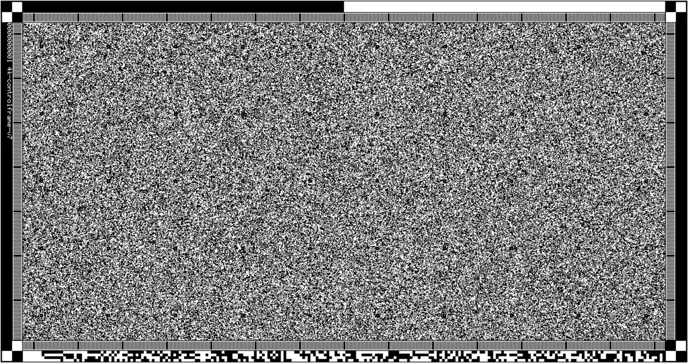

# How to decode data from piqlFilm - high-level explanation

## Getting physical scans into a digital format

The first challenge in decoding data from piqlFilm is getting high-quality
scanned / photographed images from the physical medium. Assuming you have some
kind of rig to be able to turn and photograph film frames, you will be able to
digitize photos of the film.

This unboxing tool at its current state will be able to decode film assuming the
frames are correctly numbered. Future versions of this tool may be able to scan
all images in the folder and use the metadata in each frame to determine the
frame order.

In order to correctly number a frame, one must correctly identify the so-called
"zero-reference mark frame" and name it "0" (or "000000"). You should also
include an appropriate file extension. The image file extensions supported by
this tool are: JPEG, PNG, TGA, BMP, PSD, GIF, HDR, PIC, PNM. Future versions of
this tool may support loading .raw film reel files (piql-internal format) and /
or other image formats.

The zero-reference mark frame looks like this (inverted, so on a physical film
you would expect a black square in the top right corner):

<!-- Generated with `convert dep/ivm_testdata/reel/png/000000.png -resize 1024x540 doc/i
mg/zero_reference_mark.webp` -->


After finding the zero-reference mark, you can turn the film and number each
following frame by incrementing your image name.

The following frame after the zero-reference mark should be the control frame
(so the control frame should be numbered "1" or "000001" or similar). The
control frame looks like this:

<!-- Generated with `convert dep/ivm_testdata/reel/png/000001.png -resize 1024x540 doc/i
mg/control_frame.webp` -->



There is also some helpful text in the frame margin (in this case
"4k-controlframe-v7").

If you encounter issues while decoding, you may also try reversing the order of
frames, as the zero-reference mark and control frame are repeated at the end of
the film. This means if you are missing some frames you can also attempt to copy
them to the other end of the film. More information about reconstructing damaged
film will be added in the future.

Assuming you have all the images stored in a directory and correctly numbered,
you are ready to start decoding.

## Decoding

### Control Frame

The first step to decoding the film is to decode the control frame. The unboxing
library contains configuration for every version of the control frame format,
and you should always attempt to decode with the newest version first, then
attempt successively lower versions until it decodes successfully.

See the [detailed documentation](DETAILED.md) for more information about exactly
how the decoding process works, including code samples.

The control frame contains descriptive information about the film as a whole,
such as: reel ID, print reel ID, title, description, creator, and creation date,
as well as technical information about how to decode the rest of the film, and
finally where the "Table of Contents" file is located in the film (meaning it
tells you which frames you need to decode to find the list of all files on the
film).

### Table of Contents

You can use the information on the control frame to decode the range of frames
that make up the table of contents.

The Table of Contents file may be stored multiple times on the film for
redundancy (for instance at the beginning and at the end), in which case you
should attempt to read them one-by-one. All table of contents file locations
contain the same file. Without the information in the table of contents file, it
will be hard to figure out the boundaries of other files on the film, and
restoring data will be more difficult.

The control frame includes the following information describing the location of
each table of contents file:

- The size of the table of contents file (`size`)
- Which frame the file contents start at (`start_frame`)
- Which frame the file contents end at (`end_frame`)
- Which byte offset the file contents start at (`start_byte`)
- Which byte offset the file contents end at (`end_byte`)
- The SHA1 checksum of the table of contents file (`checksum`)

The basic procedure for decoding any file as well as the table of contents is as
follows:

```txt
for each frame from the starting frame to the ending frame:
    decode the frame:
      - if `start_byte` is non-zero:
        - skip over any bytes of the decoded frame until you have skipped `start_byte` amount of bytes forward
          (You may also need to skip forward into the next frame(s) if
          `start_byte` is larger than the total size of the frame)
      - collect the remaining bytes from the frame until
        you have collected all bytes up to the `size` of the table of contents (in total)
assemble all your collected bytes into the final file.
You may verify the file contents by calculating its SHA1 checksum.
```

### The rest of the files

After successfully decoding the table of contents, you will be presented with a
list of all the files including their `size`, `start_frame`, `end_frame`,
`start_byte`, `end_byte`, and `checksum`. Using this information you can decode
every file off of the film in sequence.

For more information about using the
[unboxing library](https://github.com/piql/unboxing) you can refer to the
[detailed documentation](DETAILED.md)
